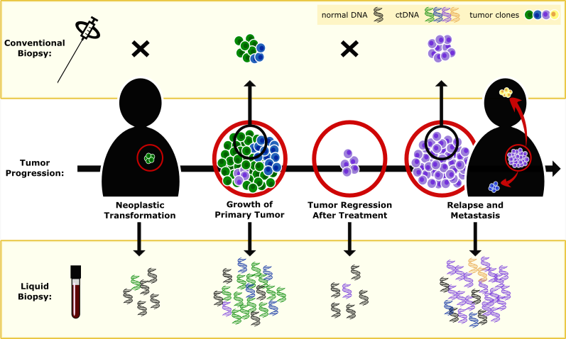
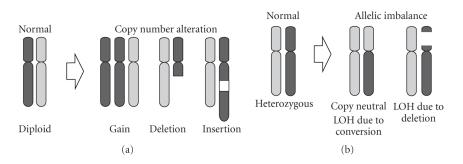
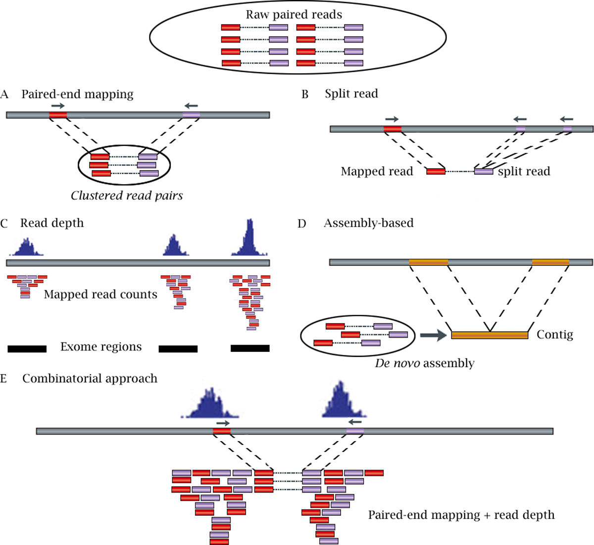
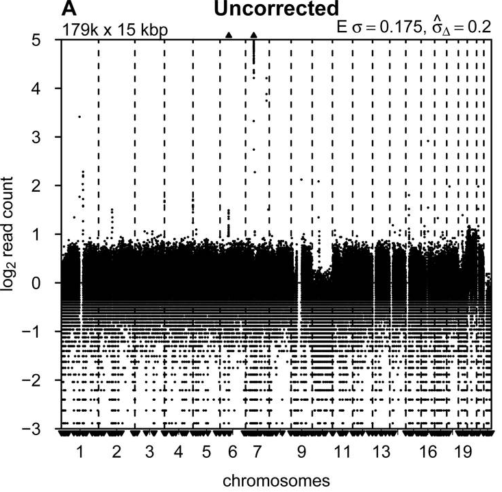
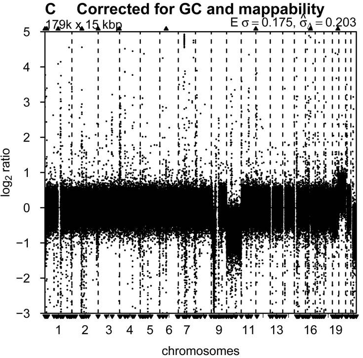
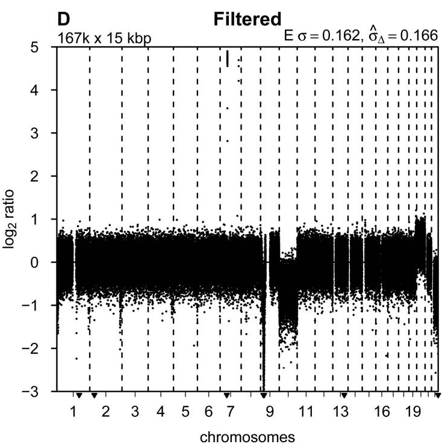
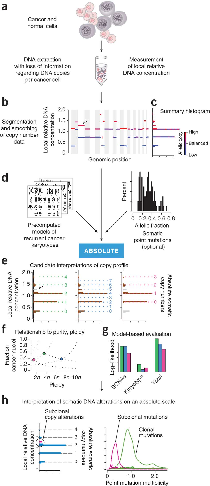
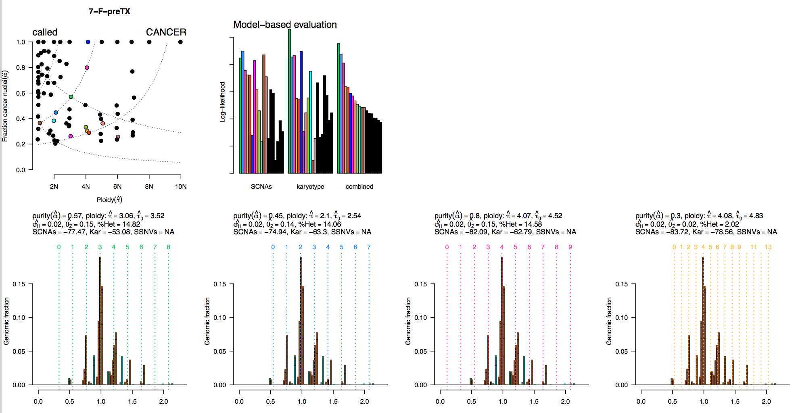

```{r setup, include=FALSE}
knitr::opts_chunk$set(echo = FALSE)
library(ggplot2)
library(ggthemes)
source("src/load.sWG.R")
data <- load.sWG.data()
absolute <- load.absolute.data()
RECIST <- load.RECIST.data()
theme_set(theme_bw())

theme_sWG <- theme_tufte() + theme(
  axis.ticks.x=element_blank(),
  axis.text.x=element_blank(),
  panel.spacing.x=unit(0, "lines"),
  panel.border=element_rect(color="grey80",fill=NA,size=1,linetype="solid"),
  panel.grid.major = element_blank(),
  panel.grid.minor = element_blank(),
  strip.background = element_blank(),
  strip.text.y = element_text(size=6),
  plot.title = element_text(hjust = 0.5)
  )

sWG.plot <- function(x){
  p <- ggplot(x) +
    scale_y_continuous(limits=c(-2,2)) + 
    labs(x="Chromosome",y=expression(Log[2]~Ratio)) +
    theme_sWG
}
```

## Background - ctDNA

<style>
img {
    display: block;
    margin: auto;
    width: 80%;
}
</style>

- cell-free DNA (cfDNA) found in plasma has nuermous uses as a biomarker.
- circulating tumour DNA (ctDNA) can be used to track tumour dynamics in real-time.
- Measuring ctDNA within plasma provides a non-invasive manner in which one can track tumour progression.



## Background - CNA
- Gene amplifications and deletions contribute signifigantly to tumorigenesis.
- Copy number alterations (CNA) have traditionally been detected with copartive genomic hybridisation (CGH) microarrays.
- Shallow whole genome sequencing (sWG), defined as coverage <1x, offers a cheap altertnative to microarray detection (<£50 per sample).



## Background - data set

- ctDNA samples from `r data$meta[,length(unique(patient))]` patients with metastatic breast cancer
- Various number of ctDNA samples per patient
```{r echo=T}
data$meta[type=="plasma",.N,patient][,table(N)]
```
- ctDNA samples taken longitutidial, with the longest period spanning `r data$meta[total.days!=0,max(total.days)]` days
- Primary tumour samples (FFPE) for `r nrow(data$meta[type=="FFPE",.N,patient])` patients
- Buffy coat (*normal*) samples for `r nrow(data$meta[type=="BC",.N,patient])` patients
- Sequencing depth of ranging from 0.001x to 0.05x (single-ended)
- Response Evaluation Criteria In Solid Tumours (RECIST) values based on MRI scans availible for `r nrow(RECIST[,.N,patient][N>1])`

## NGS methods for CNV detection



## Pipeline

### Alignment
- QC using trimgalore (<1% adapter)
- Alignment using bwa-mem
- Indexing and sorting with Samtools
- Dedupping with Picard (0.1% to 0.2% dups)
- Merge replicates using Samtools

### CNA calling
- Binning with QDNA-seq
- GC & Mappability correction with QDNA-seq
- Blacklisting with QDNA-seq
- Segmentation with DNAcopy
- CNA calling with .... TBC

## Binning

- Bin size choice: smaller bin sizes (more bins) may increase resolution of the segmentation, however, it must be balanced by the increase in varience or "noise"
- An excess of noisy bins can make the segmentation difficult, as the noise may not be Gaussian, especially when many bins have zero reads.
- *15kb bin widths for 6 million reads (~0.1x coverage) shown to work well.* - QDNA paper
    - With 0.05x coverage --> ~100 reads per bin with bin width of 30 kb
    - With 0.01x coverage --> ~100 reads per bin with bin width of 100 kb
    


## Blacklisting & Corrections

- GC content: The proportion of G and C bases in a region and the count of fragments mapped to it are directly related.
- Mappibility Correction:  A measure of how often the sequence found at the particular location will align within the whole genome
- Blacklist: Areas prone to extreme values based on the analysis of a large volumnes of data (1000G). These can be either common germline copy number variations (CNVs) or artifacts of the methodlogy.

<div style="float: left; width: 33%;">

</div>
<div style="float: left; width: 33%;">

</div>
<div style="float: right; width: 33%;">

</div>

## Segmentation: (C)BS

- Let $X_1,...,X_n$ be the log ratios of the intensities, which are indexed by the locations of the $n$ markers being studied
- Let $S_i=X_1+...+X_i, 1<=i<= n$, be the partial sums.

$$Zi = (\frac1i + \frac1{n − i})^{−1/2}(\frac{S_i}{i} − \frac{S_n − S_i}{n − i}).$$
- Let $Z_B = max(|Z_i|)$ for $1<i<N$.
- The null hypothesis of no change is rejected if the statistic exceeds the upper αth quantile of the null
distribution of ZB

```{r}
x <- data.table(i=1:200,x=c(rnorm(100,0,0.1),rnorm(100,1,0.1)))
x[,s:=cumsum(x)]
x[,denom:=(1/i + 1/(200-i))^0.5]
x[,numer.1:=s/i]
x[,numer.2:=-(max(s)-s)/(200-i)]
x[,numer:=(s/i - (max(s)-s)/(200-i))]
x[,z:=numer/denom]
ggplot(melt(x,id.vars = "i")) + aes(x=i,y=value) + geom_point() + facet_grid(variable~.,scale="free")
```

```{r}
x[,seg:=mean(x),i<which(abs(z)==max(abs(z),na.rm=T))]
ggplot(x) + aes(x=i) + geom_point(aes(y=x)) + geom_line(aes(y=seg),colour="red",size=2)
```

## Final Output

```{r}
pat <- 7
x <- data.table()
for(i in data$meta[,which(patient==pat)]){
  j <- i + 4
  stopifnot( data$meta[i,fname]==names(data$cns)[j] )
  y <- data$cns[,1:4]
  y[,total.days:=data$meta[i,total.days]]
  y[,Sample.name:=data$meta[i,Sample.name]]
  y[,cns:=data$cns[,j,with=FALSE]]
  y[,segments:=data$segments[,j,with=FALSE]]
  y$grp <- y[,c(1,which(diff(segments)!=0)+1,.N+1),chromosome][,rep(1:length(diff(V1)), diff(V1)),chromosome][,V1]
  x <- rbind(x,y)
}
x[,total.days:=total.days+0.01*(as.numeric(factor(Sample.name))-1),total.days]
x[,total.days:=factor(total.days)]
levels(x$total.days) <- x[,unique(Sample.name)[1],total.days][order(total.days),V1]
p <- sWG.plot(x) +
  geom_point(aes(x=start,y=cns),size=0.1,alpha=0.1,colour='grey40') +
  geom_hline(yintercept = 0,linetype='dashed',colour='grey80') +
  geom_line(aes(x=start,y=segments,group=interaction(Sample.name,grp),colour=cut(segments,c(-10000,-0.1,0.1,10000)))) +
  facet_grid(total.days~chromosome,scales="free_x",space="free_x",switch="x") +
  ggtitle(paste("Patient:",pat))

if(nrow(x[segments>(2)])>0){
  p <- p + geom_text(data=x[segments>(2)][,.(start=as.double(median(start))),.(total.days,chromosome,grp)],aes(x=start,y=(1.7),label='*',size=10,colour=cut(2,c(-10000,-0.1,0.1,10000))))
}
if(nrow(x[segments<(-2)])>0){
  p <- p + geom_text(data=x[segments<(-2)][,.(start=as.double(median(start))),.(total.days,chromosome,grp)],aes(x=start,y=(-2),label='*',size=10,colour=cut(-2,c(-10000,-0.1,0.1,10000))))
}

p <- p + scale_colour_manual(values=c("deepskyblue2","Black","palevioletred2")) + theme(legend.position="none")
p
```

## Quality control
 
 We need a measure of the quality of each sample. However, tradiational measures, such as the variance, are affected by CNAs. The QDNA package outputs (top right) the trimmed (0.01%) variance, however, this also appears to be affected by the presence of CNAs. Within the paper, they suggest the first order difference is a better measure of the noise.

$$Noise = median(|x_{i+1}-x_i|);~1<=i<(N-1)$$

```{r}
x <- as.data.table(cbind(
  data$meta[,.(Sample.name,type)],
  data$cns[,-(1:4)][,.(sd=lapply(.SD,function(x){sd(x)}),
                       trim.sd=lapply(.SD,function(x){sd(sort(x)[round(0.001*length(x)):round(0.999*length(x))])}),
                       noise=lapply(.SD,function(x){median(abs(diff(x)))}))]))
ggplot(melt(x,id.vars=c("Sample.name","type"))) + aes(x=variable,y=as.numeric(value),fill=type) + geom_boxplot() + facet_wrap(~variable,scales = "free")
```

```{r}
x <- x[!which(sd==max(unlist(sd))),]
x <- x[!which(sd==max(unlist(sd))),]
ggplot(melt(x,id.vars=c("Sample.name","type"))) + aes(x=variable,y=as.numeric(value),fill=type) + geom_boxplot() + facet_wrap(~variable,scales = "free")
```

### Segmentation - Sanity Check

Before we start an indepth analysis of the segmentation, lets just confirm that there are more segments found within FFPE/FF/plasma than BC samples and that they segmentation count is independent of the noise.

$$Area = \sum^N_i(|S_i|) \forall i$$

```{r}
x <- as.data.table(cbind(
  data$meta[,.(Sample.name,type)],
  data$segments[,.(n.seg=lapply(.SD[,-(1:4)],function(x){sum(by(x,chromosome,function(y){sum(diff(y)!=0)}))}),
                       area.seg=lapply(.SD[,-(1:4)],function(x){sum(abs(x))}))]))
ggplot(melt(x,id.vars=c("Sample.name","type"))) + aes(x=variable,y=as.numeric(value),fill=type) + geom_boxplot() + facet_wrap(~variable,scales = "free")
```


```{r}
x <- as.data.table(cbind(
  data$meta[,.(Sample.name,type)],
  data$cns[,-(1:4)][,.(sd=lapply(.SD,function(x){sd(x)}),
                       trim.sd=lapply(.SD,function(x){sd(sort(x)[round(0.001*length(x)):round(0.999*length(x))])}),
                       noise=lapply(.SD,function(x){median(abs(diff(x)))}))],
    data$segments[,-(1:4)][,.(n.seg=lapply(.SD,function(x){length(unique(x))}),
                       area.seg=lapply(.SD,function(x){sum(abs(x))}))]))
ggplot(x) + aes(x=unlist(noise),y=unlist(area.seg),colour=type) + geom_point()
```

## Inferring gains/losses, cellularity and abosulute copy numbers

- Cancer cells are nearly always intermixed with an unknown fraction of normal cells (purity)
- The DNA content of ctDNA from whole chromosomal abnormalties is unknown (ploidy)
- Tumours are heterogenous and various CNA may be unique to certain subclones (subclones)

### Examples
 
```{r}
x <- data.table(ploidy=rep(1:4,4),cellularity=rep(1:4,each=4)/4)
x <- x[,.(i=1:500,x=ploidy+cellularity*c(rnorm(100,0,0.1),rnorm(100,-1,0.1),rnorm(100,0,0.1),rnorm(100,1,0.1),rnorm(100,0,0.1))),.(ploidy,cellularity)]
ggplot(x) + aes(x=i,y=x) + geom_point(alpha=0.2) + facet_grid(ploidy~cellularity)
```

```{r}
x <- data.table(ploidy=rep(1:4,4),cellularity=rep(1:4,each=4)/4)
x <- x[,.(i=1:500,x=scale(ploidy+cellularity*c(rnorm(100,0,0.1),rnorm(100,-1,0.1),rnorm(100,0,0.1),rnorm(100,1,0.1),rnorm(100,0,0.1)),scale=F)[,1]),.(ploidy,cellularity)]
ggplot(x) + aes(x=i,y=x) + geom_point(alpha=0.1) + facet_grid(ploidy~cellularity)
```

## ABSOLUTE - pipeline



## ABSOLUTE - Example

```{r}
j <- data$meta[,which(Sample.name=="7-F-preTX")+4]
y <- data$cns[,1:4]
y[,cns:=data$cns[,j,with=FALSE]]
y[,segments:=data$segments[,j,with=FALSE]]
y$grp <- y[,c(1,which(diff(segments)!=0)+1,.N+1),chromosome][,rep(1:length(diff(V1)), diff(V1)),chromosome][,V1]
sWG.plot(y) +
  geom_point(aes(x=start,y=cns),size=0.1,alpha=0.1,colour='grey40') +
  geom_hline(yintercept = 0,linetype='dashed',colour='grey80') +
  geom_line(aes(x=start,y=segments,group=grp,colour=cut(segments,c(-10000,-0.1,0.1,10000)))) +
  facet_grid(~chromosome,scales="free_x",space="free_x",switch="x") +
  scale_colour_manual(values=c("deepskyblue2","Black","palevioletred2")) + theme(legend.position="none") +
  ggtitle("7-F-preTX")
```




## ABSOLUTE - Results

```{r echo=T}
x <- merge(absolute$meta[,.(Sample.name,call.status)],data$meta,all.y = T)
table(x[,.(type,call.status)],useNA = "ifany")
```

```{r}
x <- merge(absolute$meta[,.(Sample.name,call.status)],data$meta,all.y = T)
ggplot(x) + aes(x=patient,fill=call.status) + geom_bar() + facet_grid(type~.,scales = "free")
```

```{r}
x <- merge(absolute$meta[,.(Sample.name,call.status)],data$meta,all.y = T)
x$area.seg <-unlist(data$segments[,-(1:4)][,lapply(.SD,function(x){sum(abs(x))})])
x$n.seg <- unlist(data$segments[,lapply(.SD[,-(1:4)],function(x){sum(by(x,chromosome,function(y){sum(diff(y)!=0)}))})])
x$noise <- unlist(data$cns[,-(1:4)][,lapply(.SD,function(x){median(abs(diff(x)))})])
x$trim.sd <- unlist(data$cns[,-(1:4)][,lapply(.SD,function(x){sd(sort(x)[round(0.001*length(x)):round(0.999*length(x))])})])
x <- x[!which(noise==max(noise)),]
x <- x[!which(noise==max(noise)),]
x <- melt(x,id.vars = c("type","call.status"),measure.vars = c("area.seg","n.seg","noise","trim.sd"))
ggplot(x[type=="plasma" & call.status %in% c("called",NA)]) + aes(x=call.status,y=value,fill=call.status) + geom_boxplot() + facet_wrap(~variable,scales ="free_y")
```

```{r}
x <- merge(absolute$meta[,.(Sample.name,ploidy)],data$meta,all.y = T)
x[,total.days:=total.days+0.01*(as.numeric(factor(Sample.name))-1),.(patient,total.days)]
x[,total.days:=factor(total.days)]
x[is.na(ploidy),ploidy:=0]
ggplot(x) + aes(x=total.days,y=ploidy,fill=type) + geom_col() + facet_wrap(~patient,scales = "free_x") + xlab("Time") + theme(axis.text.x=element_blank())
```

```{r}
x <- merge(absolute$meta[,.(Sample.name,ploidy,purity)],data$meta,all.y = T)
x[,total.days:=total.days+0.01*(as.numeric(factor(Sample.name))-1),.(patient,total.days)]
x[,total.days:=factor(total.days)]
x[is.na(purity),purity:=0]
ggplot(x) + aes(x=total.days,y=purity,fill=type) + geom_col() + facet_wrap(~patient,scales = "free_x") + xlab("Time") + theme(axis.text.x=element_blank())
```

### RECIST Measurements

```{r}
x <- merge(absolute$meta[,.(Sample.name,type,ploidy,purity)],data$meta,all.y = T)
x <- merge(x[,.(Sample.name,type,patient=as.integer(as.character(patient)),cycle,purity,ploidy)],RECIST,by=c("patient","cycle"),all=T)
x[,outcome:=rep(if(length(na.omit(unique(outcome)))>0){na.omit(unique(outcome))}else{as.character(NA)},.N),patient]
x <- melt(x[!is.na(cycle)],id.vars = c("patient","cycle","type","outcome"),measure.vars = c("RECIST","purity","ploidy"))

ggplot(x[outcome=="response"]) + aes(x=cycle,y=value) + geom_point() + facet_grid(variable~patient,scale="free",drop=T) + stat_summary(fun.y = mean, geom="line") + ggtitle("Response")

ggplot(x[outcome=="progressive"]) + aes(x=cycle,y=value) + geom_point() + facet_grid(variable~patient,scale="free",drop=T) + stat_summary(fun.y = mean, geom="line") + ggtitle("Progressive")

ggplot(x[outcome=="stable"]) + aes(x=cycle,y=value) + geom_point() + facet_grid(variable~patient,scale="free",drop=T) + stat_summary(fun.y = mean, geom="line") + ggtitle("stable")
```


```{r}
x <- merge(absolute$meta[,.(Sample.name,type,ploidy,purity)],data$meta,all.y = T)
x <- merge(x[,.(Sample.name,type,patient=as.integer(as.character(patient)),cycle,purity,ploidy)],RECIST,by=c("patient","cycle"),all=T)
x[,outcome:=rep(if(length(na.omit(unique(outcome)))>0){na.omit(unique(outcome))}else{as.character(NA)},.N),patient]
x <- melt(x[!is.na(cycle)],id.vars = c("patient","cycle","type","outcome"),measure.vars = c("RECIST","purity","ploidy"))
x <- x[cycle<3 & !is.na(outcome) & !is.na(value),.(value.mean=mean(value),value.sd=sd(value)),.(patient,outcome,cycle,variable)]
x[,value.scaled.mean:=value.mean-value.mean[1],.(patient,variable)]

ggplot(x) + aes(x=cycle,y=value.mean,color=outcome,group=patient) + geom_line() + geom_point() + facet_wrap(~variable,scales = "free")
ggplot(x) + aes(x=cycle,y=value.scaled.mean,color=outcome,group=patient) + geom_line() + geom_point() + facet_wrap(~variable,scales = "free")
```

## Blind test

*outside link*


## Acknowledgments
- Caldas lab
    - Meiling Gao
    - Oscar Rueda
- CRUK Core

## Session Info

```{r echo=T}
sessionInfo()
```